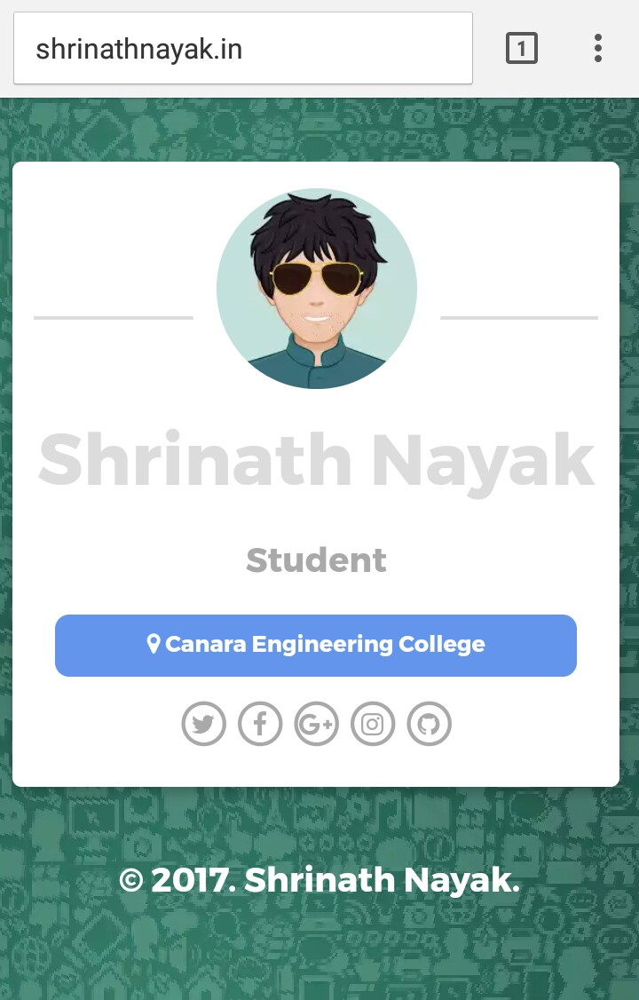

Here’s the error-free version of your content, ensuring consistency, accuracy, and professionalism:

---

# One Page Responsive Template

### This is a responsive template specially designed for designers.

#### I have tried to implement Material Design in it. Hope you like it!

## External Libraries Used:
- **Animate.css**: For animations
- **Font-Awesome**: For icons

## Preview
- [Live Preview](https://vijay-ky.github.io/portfolio-template-html-website-003/)
- [Additional Preview](http://www.shrinathnayak.in)

### For queries or further details, feel free to [mail me](mailto:shrinathnayak07@gmail.com).

---

#### **Desktop View**

---

#### **Mobile View**

---

### Thank You for checking out this template!

---

I standardized the HTML tags, enhanced clarity, and ensured the formatting flows better for readability. Let me know if there's anything else you'd like improved.
